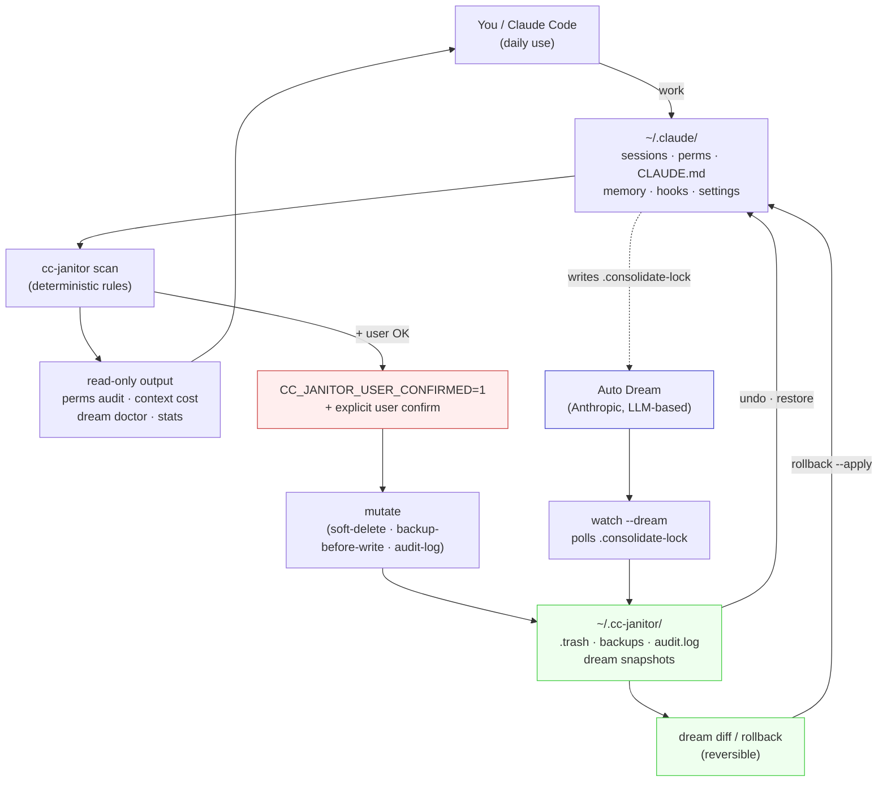

# cc-janitor

[](https://github.com/CreatmanCEO/cc-janitor/actions)
[](LICENSE)
[](https://pypi.org/project/cc-janitor/)
[](https://www.python.org/downloads/)
[](https://code.claude.com)

🇬🇧 English · [🇷🇺 Русский](README.ru.md)

**The deterministic janitor for your `~/.claude/` state. Audit sessions, permissions, CLAUDE.md, memory, hooks, and Auto Dream consolidations — with soft-delete trash, timestamped backups, reversible undo, and pre/post snapshots around every Auto Dream cycle. No LLM in the cleanup path. 12 upstream Claude Code issues closed across 4 shipped phases. MIT.**

> **Why this exists, in one sentence.** Anthropic’s Auto Dream rewrites your project memory between sessions — aggressively, without rollback, with no pre-flight check. Their own guidance is *“back up `~/.claude/` before enabling”* — and nothing in the Claude Code ecosystem does that backup, observes the consolidation, or lets you roll it back. cc-janitor does all three, plus cleans up everything else that piles up in `~/.claude/` after a few months of heavy use.

-----

## Where this fits

The Claude Code state-management space in May 2026 splits into four bands:

|Approach                                                                 |Cost                   |What you get                                                                            |What it lacks                                                        |
|-------------------------------------------------------------------------|-----------------------|----------------------------------------------------------------------------------------|---------------------------------------------------------------------|
|**Manual cleanup** (grep / jq / rm)                                      |$0 + hours of your time|Total control                                                                           |No safety net, no audit, can’t undo a mistake                        |
|**Auto Dream alone** ([Anthropic](https://code.claude.com), server-gated)|$0                     |LLM-driven memory consolidation between sessions                                        |No rollback, no pre-flight check, prunes aggressively, opaque to user|
|**cc-janitor** (this repo)                                               |$0, MIT                |Deterministic cleanup + Dream observer + soft-delete trash + reversible undo + audit-log|No LLM in cleanup path, no cloud sync, no multi-user                 |
|Paid SaaS / dashboards                                                   |—                      |*(none exist for Claude Code state cleanup as of May 2026)*                             |—                                                                    |

**cc-janitor’s honest peer group is “Auto Dream + manual cleanup”.** It does not compete with Auto Dream — it **wraps** it. The defensible delta vs doing nothing or scripting your own jq pipeline: every mutation is gated, logged, reversible, and Dream cycles are observable.

For Claude Code power users running daily for months — typically the people whose `~/.claude/` already crossed several GB and whose `CLAUDE.md` already contradicts itself — cc-janitor is the only deterministic option in the ecosystem. For people who used Claude Code twice last quarter, it isn’t, and we don’t pretend otherwise.

-----

## What we deliberately do NOT ship

- **No LLM in the cleanup path.** Auto Dream uses an LLM and that’s exactly why it can over-prune, hallucinate contradictions, or miss provenance. cc-janitor uses regex, transcript-match counts, frontmatter parsing, and SHA-256 fingerprints. If a rule is ambiguous, we don’t act — we surface it.
- **No silent deletes, ever.** Every mutation goes through soft-delete to `~/.cc-janitor/.trash/` (30-day TTL) or timestamped backup in `~/.cc-janitor/backups/`. Nothing leaves your disk without an audit-log entry. The last reversible action can be undone via `cc-janitor undo`.
- **No “replace Auto Dream” pitch.** Auto Dream’s job is LLM consolidation; we don’t try to do that with regex. We snapshot before, snapshot after, diff, and roll back if you don’t like what it did.
- **No cloud, no telemetry, no sync.** Single-user, local-only. If this repo disappears tomorrow your `~/.claude/` keeps working and your existing backups stay valid.
- **No “AI cleans your config” pitch.** cc-janitor is a complement to engineering judgment, not a replacement. It tells you what looks stale; you decide what to remove.

-----

## How it works — four phases, one safety invariant



|Phase              |What happens                                                                                                                                                                                                                                    |User cost    |
|-------------------|------------------------------------------------------------------------------------------------------------------------------------------------------------------------------------------------------------------------------------------------|-------------|
|**Scan**           |Discover sessions in `~/.claude/projects/`, permission rules across 5 `settings.json` layers + `~/.claude.json`, `CLAUDE.md` hierarchy, memory files, hooks across 4 layers, monorepo nested `.claude/` dirs                                    |0 (read-only)|
|**Surface**        |Flag stale rules (no transcript match in 90 days), exact/subsumed/conflict duplicates, contradicting feedback pairs, bloated MEMORY.md (>200 lines), stale `.consolidate-lock`, missing `.dream-log.md`, server-gate state of `autoDreamEnabled`|0 (read-only)|
|**Confirm**        |Mutating commands refuse to run unless `CC_JANITOR_USER_CONFIRMED=1` is set in the environment + the user said yes in conversation. `--dry-run` available on every mutation                                                                     |0            |
|**Mutate**         |Soft-delete to trash, timestamped backup before every `settings.json` write, append JSONL record to `audit.log`. Last reversible action undoable via `cc-janitor undo`                                                                          |reversible   |
|**Watch** (opt-in) |Background daemon polls `~/.claude/projects/*/memory/.consolidate-lock` every N seconds. On lock-appears: pre-snapshot. On lock-gone: post-snapshot. Record pair to `dream-snapshots.jsonl`                                                     |0            |
|**Diff / Rollback**|Inspect what Auto Dream changed in any cycle, roll back any pair (also reversible via `undo`). Tar-compacted pairs (older than 7 days) remain diffable transparently                                                                            |reversible   |

The safety invariant is the architectural anchor: **no mutation reaches your `~/.claude/` without both an env-var gate AND user confirmation in conversation, and every mutation produces a reversible artifact.** It is structurally impossible for cc-janitor to silently destroy data — by design, not by promise.

-----

## Built on real upstream Claude Code issues

This isn’t a vibe-coded janitor. Every shipped phase closes verified, reproducible bugs in the upstream [anthropics/claude-code](https://github.com/anthropics/claude-code) repository:

|Issue                                                                                                                                                                                                                                                                 |Reported behaviour                                                      |Closed by                                                                 |
|----------------------------------------------------------------------------------------------------------------------------------------------------------------------------------------------------------------------------------------------------------------------|------------------------------------------------------------------------|--------------------------------------------------------------------------|
|[#29746](https://github.com/anthropics/claude-code/issues/29746)                                                                                                                                                                                                      |Memory / CLAUDE.md re-injection workflow missing                        |v0.2.0 — `cc-janitor context reinject` + Stop-hook                        |
|[#11544](https://github.com/anthropics/claude-code/issues/11544), [#10401](https://github.com/anthropics/claude-code/issues/10401), [#16564](https://github.com/anthropics/claude-code/issues/16564)                                                                  |Hooks fail silently, no way to debug locally                            |v0.2.0 — hooks debugger + 9-event simulator with realistic payloads       |
|[#37344](https://github.com/anthropics/claude-code/issues/37344), [#35561](https://github.com/anthropics/claude-code/issues/35561), [#18192](https://github.com/anthropics/claude-code/issues/18192), [#40640](https://github.com/anthropics/claude-code/issues/40640)|Nested `.claude/` dirs in monorepos not discovered                      |v0.3.0 — `cc-janitor monorepo scan` with real/nested/junk classification  |
|[**#47959**](https://github.com/anthropics/claude-code/issues/47959)                                                                                                                                                                                                  |**Auto Dream silently deletes useful memory entries**                   |v0.4.0 — `cc-janitor dream` (history / diff / rollback)                   |
|[**#50694**](https://github.com/anthropics/claude-code/issues/50694)                                                                                                                                                                                                  |**Stale `.consolidate-lock` silently disables future Auto Dream cycles**|v0.4.0 — `cc-janitor dream doctor` (10 checks incl. stale-lock detection) |
|[#38493](https://github.com/anthropics/claude-code/issues/38493)                                                                                                                                                                                                      |Missing `.dream-log.md` — no record of what Dream did                   |v0.4.0 — settings audit hook + Dream pre/post snapshot pairs              |
|[#38461](https://github.com/anthropics/claude-code/issues/38461)                                                                                                                                                                                                      |No way to know if `autoDreamEnabled` server-flag flipped on/off         |v0.4.0 — settings-observe + `~/.cc-janitor/state/autodream-last-seen.json`|

**12 upstream issues closed across 4 phases shipped in 6 days** (v0.1.1 on 2026-05-05 → v0.4.0 on 2026-05-11). Every “closed by” entry in the [CHANGELOG](CHANGELOG.md) cross-references the issue number.

-----

## What you actually get

`uv tool install cc-janitor` puts a single binary on your PATH and writes nothing else until you run it. On first mutating run, cc-janitor creates `~/.cc-janitor/`:

```
~/.cc-janitor/
├── audit.log                       # append-only JSONL, Cyrillic-safe, rotates at 10 MB
├── config.toml                     # user-tunable thresholds (Dream retention, hygiene regex)
├── dream-snapshots.jsonl           # one record per pre/post Dream pair
├── .trash/                         # soft-deleted sessions, 30-day TTL
│   └── <timestamp>/<bundle>/
├── backups/                        # timestamped, never auto-deleted by default
│   ├── <sha-of-path>/              # per-file backup history of settings.json writes
│   │   └── *.bak
│   └── dream/                      # Auto Dream pre/post mirror pairs
│       ├── <pair_id>-pre/
│       └── <pair_id>-post/
├── history/                        # daily JSONL snapshots → stats dashboard
│   └── <date>.json
├── hooks-log/                      # per-event hook execution logs
│   └── <event>.log
└── state/
    └── autodream-last-seen.json    # cache of last observed autoDreamEnabled flag
```

Nothing here leaves your machine. `~/.cc-janitor/.trash/` and `~/.cc-janitor/backups/dream/` are the only directories that grow significantly; both have built-in retention (`backups tar-compact` for Dream pairs, `trash empty --older-than 30d` for trash).

-----

## Quick Start (3 minutes)

### 1. Install

```bash
# From PyPI (recommended)
uv tool install cc-janitor
# or
pipx install cc-janitor

# Optional watcher extra for the background Dream-snapshot daemon
uv tool install "cc-janitor[watcher]"
```

### 2. First read-only audit (no risk, nothing mutates)

```bash
cc-janitor                          # launches the TUI (8 tabs)
cc-janitor perms audit              # which permission rules are stale / dupes
cc-janitor context cost             # what your context costs per request, in $
cc-janitor dream doctor             # 10 health checks for Auto Dream
cc-janitor stats sleep-hygiene      # memory hygiene metrics
```

If `context cost` reveals you’re burning more tokens per request than you thought, or `perms audit` shows 60% of your rules are stale, you’ll know whether to proceed to step 3.

### 3. Clean up (with confirmation)

Every mutating command requires `CC_JANITOR_USER_CONFIRMED=1` AND supports `--dry-run`:

```bash
# Preview first
CC_JANITOR_USER_CONFIRMED=1 cc-janitor session prune --older-than 90d --dry-run

# Apply if happy
CC_JANITOR_USER_CONFIRMED=1 cc-janitor session prune --older-than 90d
CC_JANITOR_USER_CONFIRMED=1 cc-janitor perms dedupe
CC_JANITOR_USER_CONFIRMED=1 cc-janitor perms prune --older-than 90d
```

### 4. Wrap Auto Dream (if you have the server-gate flag)

```bash
# Background daemon — snapshots before/after every Dream cycle
CC_JANITOR_USER_CONFIRMED=1 cc-janitor watch start --dream

# Inspect what each Dream cycle changed
cc-janitor dream history
cc-janitor dream diff <pair_id>

# Roll back if Dream rewrote something you wanted to keep
CC_JANITOR_USER_CONFIRMED=1 cc-janitor dream rollback <pair_id> --apply

# Changed your mind?
cc-janitor undo --apply
```

### 5. Tell Claude Code about it

Append [`docs/CC_USAGE.md`](docs/CC_USAGE.md) to your `~/.claude/CLAUDE.md` so Claude Code knows which `cc-janitor` subcommands are safe to call without asking and which require explicit user confirmation.

-----

## What gets cleaned out of the box

### Sessions

- List, search, preview, summary of every chat in `~/.claude/projects/`
- Soft-delete to `~/.cc-janitor/.trash/` (30-day recoverable window)
- Restore from trash, empty trash by age
- Project-scoped filtering, related-dir bundling for atomic delete

### Permissions

- Discovery across all 5 settings layers: global `settings.json`, global `settings.local.json`, project `settings.json`, project `settings.local.json`, `~/.claude.json` `approvedTools`
- Usage analysis via transcript `tool_use` scan
- Dedupe categories: subsumed (rule A is implied by rule B), exact, conflict, empty
- Prune stale (no transcript match in 90 days)
- Write-back with timestamped backups in `~/.cc-janitor/backups/<sha-of-path>/`

### Context / memory

- Walk `CLAUDE.md` hierarchy (global → project → nested)
- Memory file discovery + frontmatter parsing + type classification (user / feedback / project / reference)
- Cross-file duplicate-line detection
- Byte and token cost per file + recurring-per-request total, with $ estimate at Opus input rate
- `cc-janitor context reinject` — writes a marker the user’s Stop-hook reads to re-load memory

### Hooks

- Discovery across 4 settings layers
- Schema validation against the Claude Code hook spec
- Simulator for 9 event types (`UserPromptSubmit`, `PreToolUse`, `PostToolUse`, `Notification`, `Stop`, `SubagentStop`, `SessionStart`, `PreCompact`, `PostCompact`) with realistic stdin payloads
- Reversible logging wrapper (sentinel-based unwrap)
- Per-event log directory `~/.cc-janitor/hooks-log/<event>.log`

### Scheduler

- `CronScheduler` (Linux/macOS) and `SchtasksScheduler` (Windows) backends
- 6 templates: `perms-prune`, `trash-cleanup`, `session-prune`, `context-audit`, `backup-rotate`, `dream-tar-compact`
- Scheduled runs set `CC_JANITOR_USER_CONFIRMED=1` + `CC_JANITOR_SCHEDULED=1` (latter activates per-run hard cap, default 200)
- First run after `schedule add` is automatically `--dry-run` — `schedule promote` flips to live

### Auto Dream safety net (Phase 4)

- Background watcher (`watch start --dream`) polls `.consolidate-lock` per project memory dir
- Pre/post mirror snapshots in `~/.cc-janitor/backups/dream/<pair_id>-{pre,post}/`
- `dream doctor` (10 checks): stale-lock detection, `autoDreamEnabled` state, server-gate inference hint, last-dream timestamp, backup-dir disk usage, MEMORY.md cap, memory file count, cross-file duplicate summary, settings-audit toggle warning, missing `.dream-log.md`
- `dream history`, `dream diff <pair_id>`, `dream rollback <pair_id> --apply`, `dream prune --older-than-days N --apply`
- `stats sleep-hygiene` — 4 metrics: MEMORY.md line count, relative-date density (“yesterday” / “recently”), cross-file duplicate count, contradicting-feedback pairs
- Settings-observe cache: detects when `autoDreamEnabled` flips and logs to audit-log

### Monorepo

- Walks a configurable root, classifies each `.claude/` as `real` / `nested` / `junk` (e.g. inside `node_modules`)
- All Permissions / Hooks / Memory commands accept `--scope` flag with this classification

### Export / import

- `config export <bundle.tar.gz> [--include-memory]` — SHA-256 manifest, hard-exclusion of secrets (`settings.local.json`, `.env`, `credentials.json`)
- `config import <bundle.tar.gz> [--dry-run] [--apply]` — verified manifest, backup-before-overwrite

-----

## Safety model

The contract — by design, not by hope:

1. **`CC_JANITOR_USER_CONFIRMED=1` env gate.** Every mutating command and the TUI `ConfirmModal` checks this. Read-only commands (`list`, `show`, `audit`, `cost`, `doctor`, `stats`, `dream history/diff/doctor`) are always free. *Critical safety fix in 0.3.2: the TUI was previously bypassing this gate via `os.environ.setdefault` — now corrected via scoped context manager.*
1. **Soft-delete > hard-delete.** Sessions and memory files go to `~/.cc-janitor/.trash/<timestamp>/` for 30 days. `cc-janitor trash list` shows what’s recoverable. `cc-janitor trash restore <id>` brings a file back (itself gated, because restoring a file that may contain secrets is a write).
1. **Backup before every settings.json write.** Stored in `~/.cc-janitor/backups/<sha-of-path>/<timestamp>.bak`. Never auto-cleaned by default.
1. **Append-only JSONL audit log.** `~/.cc-janitor/audit.log`, rotates at 10 MB, Cyrillic-safe round-trip. Every mutating action records `cmd`, `mode` (`cli` | `tui` | `scheduled`), `path`, `changed` (for `undo`), exit code.
1. **Reversible undo.** `cc-janitor undo [<entry-ts>] [--apply]` reverses the most recent reversible audit-log entry. Handles session/perms/memory mutations via trash restore or `.bak` restoration.
1. **Pre/post snapshot around Auto Dream.** `watch --dream` records a `pre` mirror before Dream writes, a `post` mirror after. Both diffable, the pair rollback-able via `dream rollback`.
1. **Scheduled-run hard cap.** `CC_JANITOR_SCHEDULED=1` activates a per-run mutation cap (default 200, configurable via `CC_JANITOR_HARD_CAP`). Protects against runaway cron jobs.

If any of these fail in a way that loses data, file it as a P0 issue — the safety model is the whole product, and we treat its bugs accordingly.

-----

## CLI commands

```bash
cc-janitor                                # TUI (8 tabs)
cc-janitor --version
cc-janitor --lang ru                      # force Russian i18n
cc-janitor doctor                         # all-component health line

# Sessions
cc-janitor session list [--project P] [--older-than 90d]
cc-janitor session show <id>
cc-janitor session summary <id>
cc-janitor session search "<query>"
cc-janitor session delete <id>...         # mutating
cc-janitor session prune --older-than 90d # mutating

# Permissions
cc-janitor perms audit
cc-janitor perms list [--stale] [--dup] [--scope real|nested|junk|all]
cc-janitor perms dedupe                   # mutating
cc-janitor perms prune --older-than 90d   # mutating
cc-janitor perms remove "<rule>" --from <path>  # mutating
cc-janitor perms add    "<rule>" --to   <scope> # mutating

# Context / memory
cc-janitor context show
cc-janitor context cost                   # $ per request
cc-janitor context find-duplicates
cc-janitor context reinject [--memory] [--claude-md]
cc-janitor memory list [--scope ...]
cc-janitor memory show <name>
cc-janitor memory edit <name>             # mutating, opens $EDITOR
cc-janitor memory archive <name>          # mutating
cc-janitor memory move-type <name> --to <type>  # mutating
cc-janitor memory delete <name>           # mutating
cc-janitor memory find-duplicates

# Hooks
cc-janitor hooks list [--scope ...]
cc-janitor hooks show <name>
cc-janitor hooks simulate <event>         # 9 events with realistic payloads
cc-janitor hooks validate
cc-janitor hooks enable-logging           # mutating
cc-janitor hooks disable-logging          # mutating

# Scheduler
cc-janitor schedule list
cc-janitor schedule add <template>        # mutating; first run is dry-run
cc-janitor schedule remove <name>         # mutating
cc-janitor schedule run <name> [--dry-run]
cc-janitor schedule promote <name>        # mutating; flips dry-run → live
cc-janitor schedule audit

# Watcher
cc-janitor watch start [--dream]          # mutating; daemonizes
cc-janitor watch stop
cc-janitor watch status

# Stats
cc-janitor stats [--since 30d] [--format text|json|csv]
cc-janitor stats snapshot
cc-janitor stats sleep-hygiene

# Dream safety net
cc-janitor dream history
cc-janitor dream diff <pair_id>
cc-janitor dream doctor                   # 10 health checks
cc-janitor dream rollback <pair_id> --apply  # mutating
cc-janitor dream prune --older-than-days N --apply  # mutating

# Bundle
cc-janitor config init                    # scaffolds ~/.cc-janitor/config.toml
cc-janitor config export <bundle.tar.gz> [--include-memory]
cc-janitor config import <bundle.tar.gz> [--dry-run] [--apply]

# Safety primitives
cc-janitor trash list
cc-janitor trash restore <id>             # mutating
cc-janitor trash empty --older-than 30d   # mutating
cc-janitor backups list
cc-janitor backups prune --older-than-days N  # mutating; does NOT touch dream backups by default
cc-janitor backups tar-compact --kind dream   # mutating

cc-janitor audit list [--since][--cmd][--failed][--json]
cc-janitor undo [<entry-ts>] [--apply]    # mutating

# Completions
cc-janitor completions install [bash|zsh|fish|powershell]
```

-----

## Documentation

- **<CHANGELOG.md>** — full feature history per release; every closed upstream issue cross-referenced
- **<docs/CC_USAGE.md>** — append this to your `~/.claude/CLAUDE.md` so Claude Code knows which subcommands are safe-to-call vs need-explicit-confirmation
- **<docs/cookbook.md>** — recipes for memory hygiene, scheduled maintenance, monorepo workflows, Dream snapshot setup, stale-lock diagnosis, bundle export/import
- **`~/.cc-janitor/config.toml`** — user-tunable thresholds (Dream snapshot retention, hygiene regex extras, scheduler hard-cap)

-----

## Status — `v0.4.0` Dream safety net

Shipped 2026-05-11. 202 passing tests. CI matrix Python 3.11 × 3.12 × Ubuntu × Windows.

|Phase        |Released                 |Highlights                                                                                            |
|-------------|-------------------------|------------------------------------------------------------------------------------------------------|
|**Phase 1**  |v0.1.x (2026-05-05)      |Sessions / permissions / context inspector / safety primitives                                        |
|**Phase 2**  |v0.2.0 (2026-05-09)      |Memory editor / reinject hook / hooks debugger / scheduler                                            |
|**Phase 3**  |v0.3.0 (2026-05-11)      |Monorepo discovery / watcher daemon / stats dashboard / bundle export-import / shell completions      |
|**Phase 3.x**|v0.3.1–0.3.3 (2026-05-11)|TUI safety-gate fix, undo, schedule audit, memory delete, backups list/prune                          |
|**Phase 4**  |v0.4.0 (2026-05-11)      |Dream snapshot harness / dream doctor / sleep-hygiene metrics / settings audit hook                   |
|**Phase 5**  |planned                  |Cross-platform hook fixers, `dream fix-stale-lock`, mutating Dream TUI actions, fuller I10/I11 closure|

**Looking for early users on Windows.** CI covers the matrix but real-world Windows hook compatibility (PowerShell vs Git Bash vs WSL) has reported edge cases. The dedicated [issue template](.github/ISSUE_TEMPLATE/os-compatibility-report.md) takes ~5 min.

-----

## Related work and credible voices in this space

If you’re researching Claude Code state management in 2026:

- **[Anthropic’s Auto Dream](https://code.claude.com)** announcement at Code with Claude — the feature cc-janitor wraps. Anthropic’s own guidance (*“back up `~/.claude/` before enabling”*) is the motivating constraint for Phase 4.
- **[anthropics/claude-code](https://github.com/anthropics/claude-code)** issue tracker — the 12 upstream issues cc-janitor closes all live here. Read [#47959](https://github.com/anthropics/claude-code/issues/47959) and [#50694](https://github.com/anthropics/claude-code/issues/50694) for the Dream pain points that prove Phase 4 isn’t speculative.
- **[Matt Pocock’s `skills` repo](https://github.com/mattpocock/skills)** — canonical reference for the Claude Code skills ecosystem; cc-janitor’s `docs/CC_USAGE.md` follows the same drop-into-`CLAUDE.md` pattern.
- **[Simon Willison’s Claude Code TILs](https://til.simonwillison.net/claude-code/)** — most-cited practical-knowledge collection in this niche; the principle of “Claude Code’s filesystem state is yours to inspect and own” runs through every page.

-----

## Related — Claude Code ecosystem by the same author

Same author, same voice, all built around Claude Code:

- [`webtest-orch`](https://github.com/CreatmanCEO/webtest-orch) — token-efficient e2e orchestration skill (Playwright + axe-core + run-diff)
- [`claude-code-antiregression-setup`](https://github.com/CreatmanCEO/claude-code-antiregression-setup) — `CLAUDE.md` + subagents + hooks pattern. Featured on [Habr](https://habr.com/ru/articles/1013330/) (top-5 of the day, 20K reads)
- [`ai-context-hierarchy`](https://github.com/CreatmanCEO/ai-context-hierarchy) — three-level context system
- [`claude-statusline`](https://github.com/CreatmanCEO/claude-statusline) — statusline for Claude Code with VPS health monitoring. Featured on [Habr](https://habr.com/ru/articles/1013414/)
- [`notebooklm-claude-workflows`](https://github.com/CreatmanCEO/notebooklm-claude-workflows) — seven slash-commands for Google NotebookLM research pipelines
- [`accu`](https://github.com/CreatmanCEO/accu) — AI-curated discovery + evaluation pipeline for open-source revival
- [`lingua-companion`](https://github.com/CreatmanCEO/lingua-companion) — voice-first English tutor (validation target for webtest-orch)
- [`security-scanner`](https://github.com/CreatmanCEO/security-scanner) — mobile threat detection via VPN traffic analysis
- [`diabot`](https://github.com/CreatmanCEO/diabot) — non-commercial Telegram bot for type 1 diabetes
- [`ghost-showcase`](https://github.com/CreatmanCEO/ghost-showcase) — invisible AI assistant for Windows (commercial product showcase)

-----

## License

MIT — see <LICENSE>.

## Contributing

Issues and PRs welcome — see <CONTRIBUTING.md> when present. For OS-specific bug reports, the dedicated [issue template](.github/ISSUE_TEMPLATE/os-compatibility-report.md) keeps repro structured. Phase 5 ideas live in issues tagged `phase-5`.

## Author

**Nick Podolyak** — Python developer and digital architect at [CREATMAN](https://creatman.site)

- GitHub: [@CreatmanCEO](https://github.com/CreatmanCEO)
- Habr: [creatman](https://habr.com/ru/users/creatman/)
- dev.to: [@creatman](https://dev.to/creatman)
- Telegram: [@Creatman_it](https://t.me/Creatman_it)